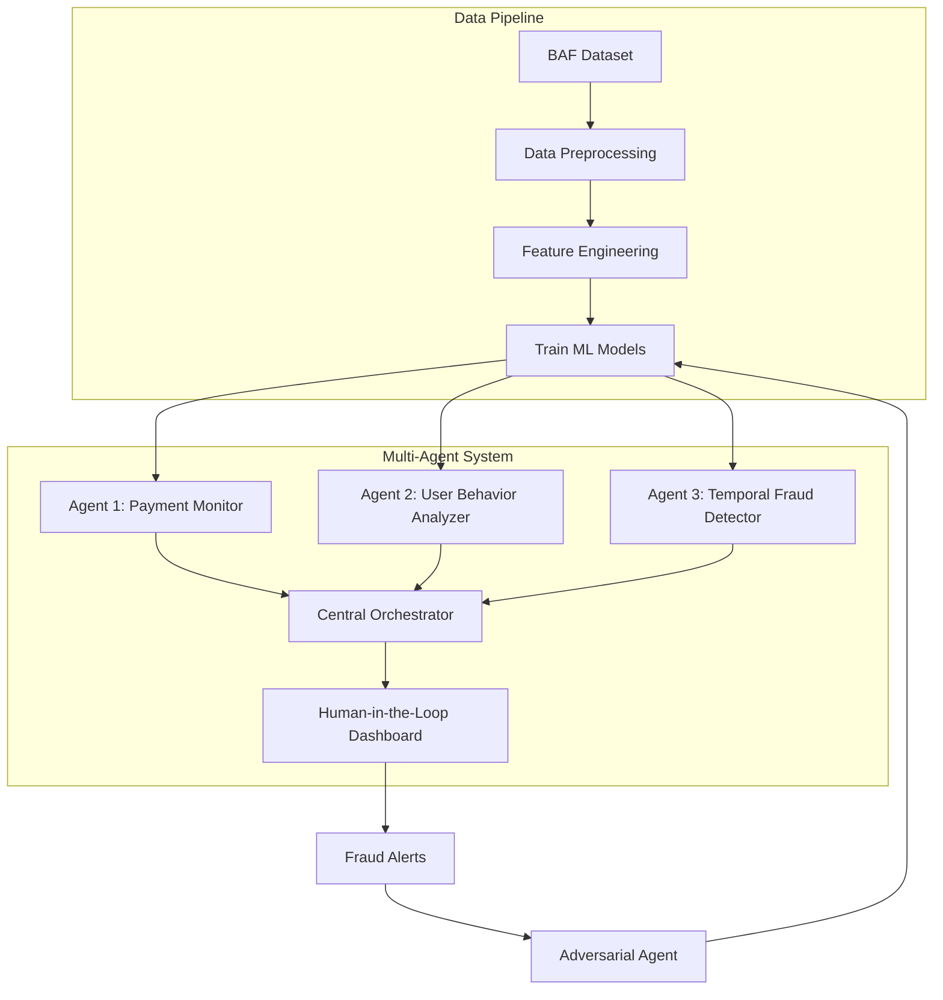

# **AI-Powered Multi-Agent Fraud Detection System**  
*Hackathon Project | Financial Fraud Detection using BAF Dataset*  

    

## **📌 Overview**  
This project tackles **real-time fraud detection in financial transactions** using a **multi-agent AI system** built for the hackathon challenge. We leverage the **Bank Account Fraud (BAF) Dataset**—a realistic, biased, and imbalanced synthetic dataset from NeurIPS 2022—to train ML models and deploy collaborative AI agents that detect fraud while minimizing false positives.  

🔗 **Paper:** [NeurIPS 2022](https://arxiv.org/abs/2211.13358) | **Dataset:** [Kaggle](https://www.kaggle.com/datasets/feedzai/bank-account-fraud)  

---

## **🎯 Problem Statement**  
**"AI Agents for Fraud Detection in Financial Transactions"**  
Traditional rule-based fraud detection systems fail to adapt to evolving fraud tactics. Our solution:  
✅ **Decentralized AI agents** monitoring different transaction types.  
✅ **ML-powered classification** (fraud vs. legitimate).  
✅ **Adaptive learning** from historical fraud patterns.  
✅ **Human-in-the-loop** for transparency and reduced false alerts.  


---

## **📂 Dataset: Bank Account Fraud (BAF) Suite**  
A synthetic, privacy-preserving dataset with:  
- **1M instances** across 6 biased variants.  
- **30 realistic features** (e.g., transaction amount, payment type).  
- **Temporal column (`month`)** for dynamic distribution shifts.  
- **Protected attributes** (age, employment status, income %).  

### **Dataset Variants**  
| Variant | Bias Type | Class Imbalance |  
|---------|-----------|-----------------|  
| `Base`  | None      | Extreme (0.1% fraud) |  
| `D1-D5` | Controlled biases (e.g., demographic, temporal) | Varies |  

📄 **Datasheet:** [GitHub](https://github.com/feedzai/bank-account-fraud/blob/main/documents/datasheet.pdf)  

---

## **🛠️ Solution Architecture**  


### **Key Components**  
1. **Data Preprocessing**  
   - Handle class imbalance (SMOTE, undersampling).  
   - Encode temporal features (`month`).  
2. **Machine Learning Models**  
   - LightGBM, XGBoost (baseline).  
   - Adaptive retraining with new fraud patterns.  
3. **AI Agents**  
   - **Payment Monitor**: Flags high-risk transactions.  
   - **User Behavior Analyzer**: Tracks anomalies in spending.  
   - **Temporal Fraud Detector**: Identifies time-based shifts.  
4. **Human-in-the-Loop**  
   - Streamlit dashboard for fraud analysts.  
   - Feedback loop to improve models.  


---

## **📜 Citation**  
If you use this project or the BAF dataset, cite:  
```bibtex
@article{jesusTurningTablesBiased2022,
  title={Turning the {{Tables}}: {{Biased}}, {{Imbalanced}}, {{Dynamic Tabular Datasets}} for {{ML Evaluation}}},
  author={Jesus, S{\'e}rgio and Pombal, Jos{\'e} and Alves, Duarte and Cruz, Andr{\'e} and Saleiro, Pedro and Ribeiro, Rita P. and Gama, Jo{\~a}o and Bizarro, Pedro},
  journal={Advances in Neural Information Processing Systems},
  year={2022}
}
```

